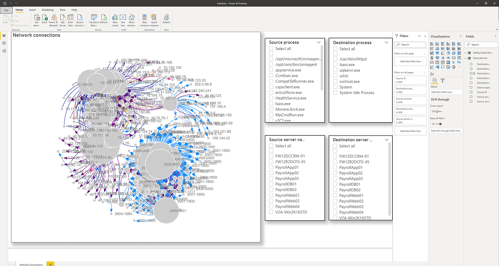

# Dependency analysis using Powershell in Azure Migrate

This powershell module helps you automate enabling and disabling dependency analysis on a large number of VMware VMs discovered in Azure Migrate. These are applicable to the agentless dependency analysis feature. 

## Overview 
With this PowerShell module you can:
- Get a list of discovered VMware machines along with the status on whether dependency analysis is currently enabled.
- Enable or disable dependency analysis on a large number of VMs.
- Visualize network connections using downloaded dependency data. The downloaded dependency data can be imported into a PowerBI to visualize a map of network connections. The data can be downloaded for one appliance at a time. You can filter the map by servers and processes

## Current Limitations:
- Agentless dependency analysis can be enabled on 1000 VMs concurrently.

## Pre-requisites
Before you get started, you need to do the following:
- [Review](https://docs.microsoft.com/azure/migrate/migrate-support-matrix-vmware#dependency-analysis-requirements-agentless) supported operating systems, and required permissions for agentless dependency analysis.
- Have an Azure Migrate project and the Azure Migrate:Server Assessment tool is added to the project.
- Set up an [Azure Migrate appliance](https://docs.microsoft.com/azure/migrate/migrate-appliance) to discover the on-premises VMware VMs. The appliance discovers on-premises machines, and sends metadata and performance data to Azure Migrate:Server Assessment.
- Ensure that VMware Tools (later than 10.2) is installed on each VM you want to analyze.
- Ensure you have downloaded the AzMig_Dependencies powershell module in this folder.
- Ensure you have PowerShell available. It is recommended you use the [latest version of PowerShell](https://docs.microsoft.com/powershell/scripting/install/installing-powershell).
- Ensure you have the [Azure PowerShell](https://docs.microsoft.com/powershell/azure/install-az-ps) module installed. 

## Log in to Azure

1. Log into your Azure subscription using the Connect-AzAccount cmdlet.

```PowerShell
Connect-AzAccount
```

If using Azure Government, use the following command.

```PowerShell
Connect-AzAccount -EnvironmentName AzureUSGovernment
```

2. Select the subscription in which you have created the Azure Migrate project 

```PowerShell
Select-AZSubscription -subscription "Fabrikam Demo Subscription"
```

3. Import the downloaded AzMig_Dependencies powershell module

```PowerShell
Import-Module .\AzMig_Dependencies.psm1
```
## Enable or disable dependency data collection

1. Get the list of discovered VMware VMs in your Azure Migrate project using the following commands. In the example below, the project name is FabrikamDemoProject, and the resource group it belongs to is FabrikamDemoRG. The list of machines will be saved in FabrikamDemo_VMs.csv

```PowerShell
Get-AzMigDiscoveredVMwareVMs -ResourceGroupName "FabrikamDemoRG" -ProjectName "FabrikamDemoProject" -OutputCsvFile "FabrikamDemo_VMs.csv"
```
> Please note the project name in the above query is the same one that is displayed in the Azure Portal. 

In the file, you can see the VM display name, current status of dependency collection and the ARM ID of all discovered VMs. 

2. To enable or disable dependencies, create an input CSV file. The file is required to have a column with header "ARM ID". Any additional headers in the CSV file will be ignored. You can create the CSV using the file generated in the previous step. Create a copy of the file retaining the VMs you want to enable or  disable dependencies on. 

In the following example, dependency analysis is being enabled on the list of VMs in the input file FabrikamDemo_VMs_Enable.csv.

```PowerShell
Set-AzMigDependencyMappingAgentless -InputCsvFile .\FabrikamDemo_VMs_Enable.csv -Enable
```

In the following example, dependency analysis is being disabled on the list of VMs in the input file FabrikamDemo_VMs_Disable.csv.

```PowerShell
Set-AzMigDependencyMappingAgentless -InputCsvFile .\FabrikamDemo_VMs_Disable.csv -Disable
```

## Visualize network connections in PowerBI

1. Run the following command. This command downloads the dependencies data in a CSV and processes it to generate a list of unique dependencies that can be used for visualization in PowerBI. In the example below the project name is FabrikamDemoProject, and the resource group it belongs to is FabrikamDemoRG. The dependencies will be downloaded for machines discovered by FabrikamAppliance. The unique dependencies will be saved in FabrikamDemo_Dependencies.csv

```PowerShell
Get-AzMigDependenciesAgentless -ResourceGroup FabrikamDemoRG -Appliance FabrikamAppliance -ProjectName FabrikamDemoProject -OutputCsvFile "FabrikamDemo_Dependencies.csv"
```

2. Download the PowerBI template. 

3. Load the downloaded dependency data in PowerBI.
- Open the template in PowerBI
- Click on "Get Data" on the tool bar. 
- Choose "Text/CSV" from Common data sources.
- Choose the dependencies file downloaded
- Click "Transform Data"
- You will see a table is imported with the name of the CSV file. On the right hand side you will see the option to rename the table, rename it to AzMig_Dependencies
- Click "Close & Apply"
- Click on refresh from the tool bar.

The Network Connections chart and the Source server name, Destination server name, Source process name, Destination process name slicers should light up with the imported data.

4. Visualize the map of network connections filtering by servers and processes.
> Below is an example output when the data is visualized within PowerBI

